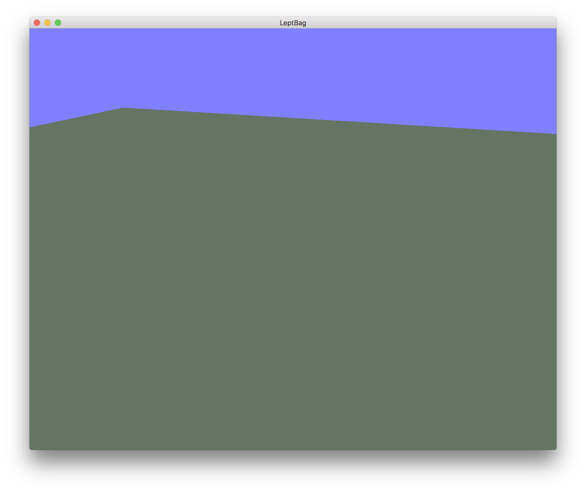
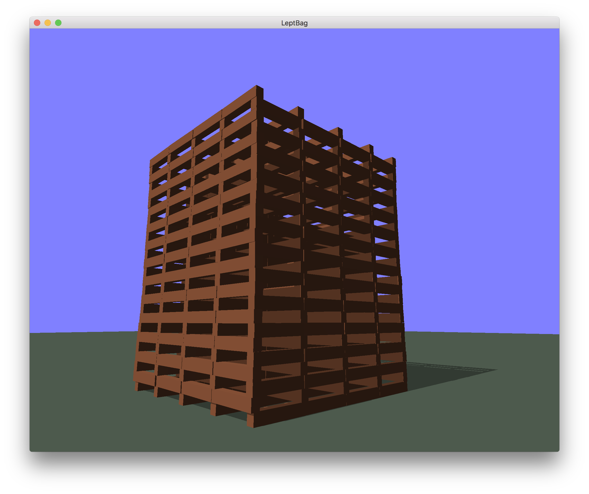
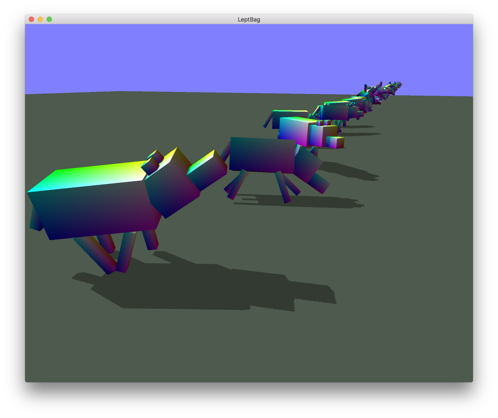

#LeptBag

　Leptbagは3次元物理シミュレーションを簡単に行うことができるように作成されたプログラムです。また、3次元物理シミュレーションと言っても、初期条件だけを設定し結果を見るだけの仕組みではなく。木や動物などの「オブジェクト」と、プログラミング言語で記述された「スクリプト」を紐付けることで、時系列的な力の入力を与えることや、現在の剛体の速度・傾きなどを取得してフィードバックをかけることなどをサポートしています。 
　本体プログラムはC++によって開発され、プラグインはD言語によって開発されています。本体での描画にはOpenGLを、物理シミュレーションの計算にはBulletライブラリを使用しています。  
　

## ビルド
執筆中

## サンプル紹介+使用方法
　サンプルプラグインは/friendsに入っています。それぞれdub buildして、.friendsファイルを/source/friendsにインストールすることで使うことができます。
　
### SimpleFloor
　チームの中でも最も大人気のプラグインです。効果は単純で、平坦な「床」オブジェクトを追加します。実行すると次のように床が表示されます。

　内部的には無限に床が広がっていることになっているのですが、描画的な制限と、人間が床を認識しやすくするために描画は一部に限られています。  
　このプラグインのコードは次のようになっています。

~~~d
import core.stdc.stdio;
import std.stdio;
import core.runtime;

import leptbagSDK.leptbaglib;
import dlib.math.vector;
import dlib.math.quaternion;

//ApplicationInterface----------------------

extern (C) void init(){
	rt_init();

	getPlaneShape().generate(parameterPack(
									param("position", Vector3f(0, 0, 0)),
									param("scale",    Vector3f(1, 1, 1)),
									param("face",     Vector3f(0, 1, 0)),
									param("rotation", Quaternionf(0, 0, 0, 1)),
									param("mass",     0.0f)));
}

extern (C) void tick(){

}

//------------------------------------------
~~~

　まず、init関数とtick関数はLeptBagのプラグインでは実装必須の関数となっています。init関数はプラグインがロードされたときに呼び出され、tick関数は毎フレーム描画が行われる直前に呼び出されます。
床オブジェクトは時間的な変化を行わないので、initで床の生成だけ行い、tick関数は空になっています。(空の場合でも関数を宣言する必要があります。)  
　init関数内の解説をします。rt_init();関数はDの標準ライブラリのcore.runtimeにある関数で、D言語のランタイムを立ち上げる関数です。動的ライブラリの場合これは自動で呼び出されないので、自前で呼び出してあげる必要があります(たぶん)。  
　床オブジェクトはプリミティブとして宣言されているので簡単に生成することができます。getPlaneShape()で「床オブジェクトを生成するelementManager」にアクセスすることができます。elementManagerはLeptBagの根幹にある仕組みで、これを用いることで「同じ原型のものを」「大量に」描画することができます。  
　elementManagerから実際にオブジェクトを作成するには、generate関数を用います。generate関数の引数はparameterPackといういわゆる「名前付き引数」をソフトに再現したものになっています。planeShapeの必要パラメーターは"position", "scale", "face", "rotation", "mass"であり、それぞれ位置、大きさ(物理的には無限大だが、描画する上でのサイズ)、向き、回転(向きと被っているが、こちらは描画する際に必要)、重量(bulletPhysicsの仕様により、重さ0で固定物体(衝突しても絶対に動かないオブジェクト)になっています。)

### PlankTower
　木片のタワーを積み上げるだけのプラグインです。
　

~~~d
import core.runtime;
import std.stdio;
import std.math;
import std.json;
import std.random;

import leptbagSDK.leptbaglib;

Random rnd;

elementManager plank;
vertexManager plankVertex;

//ApplicationInterface----------------------

extern (C) void init(){
	rt_init();

	float r = 0.5;
	float g = 0.3;
	float b = 0.2;

	plankVertex = createVertexManager();
	plankVertex.addVertex(createVertex(-1.0f, -1.0f, -1.0f, -1.0f,  0.0f,  0.0f,  r,  g,  b));
	plankVertex.addVertex(createVertex(-1.0f, -1.0f,  1.0f, -1.0f,  0.0f,  0.0f,  r,  g,  b));
	plankVertex.addVertex(createVertex(-1.0f,  1.0f,  1.0f, -1.0f,  0.0f,  0.0f,  r,  g,  b));
	plankVertex.addVertex(createVertex(-1.0f, -1.0f, -1.0f, -1.0f,  0.0f,  0.0f,  r,  g,  b));
	plankVertex.addVertex(createVertex(-1.0f,  1.0f,  1.0f, -1.0f,  0.0f,  0.0f,  r,  g,  b));
	plankVertex.addVertex(createVertex(-1.0f,  1.0f, -1.0f, -1.0f,  0.0f,  0.0f,  r,  g,  b));
	plankVertex.addVertex(createVertex( 1.0f, -1.0f,  1.0f,  0.0f, -1.0f,  0.0f,  r,  g,  b));
	plankVertex.addVertex(createVertex(-1.0f, -1.0f, -1.0f,  0.0f, -1.0f,  0.0f,  r,  g,  b));
	plankVertex.addVertex(createVertex( 1.0f, -1.0f, -1.0f,  0.0f, -1.0f,  0.0f,  r,  g,  b));
	plankVertex.addVertex(createVertex( 1.0f, -1.0f,  1.0f,  0.0f, -1.0f,  0.0f,  r,  g,  b));
	plankVertex.addVertex(createVertex(-1.0f, -1.0f,  1.0f,  0.0f, -1.0f,  0.0f,  r,  g,  b));
	plankVertex.addVertex(createVertex(-1.0f, -1.0f, -1.0f,  0.0f, -1.0f,  0.0f,  r,  g,  b));
	plankVertex.addVertex(createVertex( 1.0f,  1.0f, -1.0f,  0.0f,  0.0f, -1.0f,  r,  g,  b));
	plankVertex.addVertex(createVertex(-1.0f, -1.0f, -1.0f,  0.0f,  0.0f, -1.0f,  r,  g,  b));
	plankVertex.addVertex(createVertex(-1.0f,  1.0f, -1.0f,  0.0f,  0.0f, -1.0f,  r,  g,  b));
	plankVertex.addVertex(createVertex( 1.0f,  1.0f, -1.0f,  0.0f,  0.0f, -1.0f,  r,  g,  b));
	plankVertex.addVertex(createVertex( 1.0f, -1.0f, -1.0f,  0.0f,  0.0f, -1.0f,  r,  g,  b));
	plankVertex.addVertex(createVertex(-1.0f, -1.0f, -1.0f,  0.0f,  0.0f, -1.0f,  r,  g,  b));
	plankVertex.addVertex(createVertex( 1.0f,  1.0f,  1.0f,  1.0f,  0.0f,  0.0f,  r,  g,  b));
	plankVertex.addVertex(createVertex( 1.0f, -1.0f, -1.0f,  1.0f,  0.0f,  0.0f,  r,  g,  b));
	plankVertex.addVertex(createVertex( 1.0f,  1.0f, -1.0f,  1.0f,  0.0f,  0.0f,  r,  g,  b));
	plankVertex.addVertex(createVertex( 1.0f, -1.0f, -1.0f,  1.0f,  0.0f,  0.0f,  r,  g,  b));
	plankVertex.addVertex(createVertex( 1.0f,  1.0f,  1.0f,  1.0f,  0.0f,  0.0f,  r,  g,  b));
	plankVertex.addVertex(createVertex( 1.0f, -1.0f,  1.0f,  1.0f,  0.0f,  0.0f,  r,  g,  b));
	plankVertex.addVertex(createVertex( 1.0f,  1.0f,  1.0f,  0.0f,  1.0f,  0.0f,  r,  g,  b));
	plankVertex.addVertex(createVertex( 1.0f,  1.0f, -1.0f,  0.0f,  1.0f,  0.0f,  r,  g,  b));
	plankVertex.addVertex(createVertex(-1.0f,  1.0f, -1.0f,  0.0f,  1.0f,  0.0f,  r,  g,  b));
	plankVertex.addVertex(createVertex( 1.0f,  1.0f,  1.0f,  0.0f,  1.0f,  0.0f,  r,  g,  b));
	plankVertex.addVertex(createVertex(-1.0f,  1.0f, -1.0f,  0.0f,  1.0f,  0.0f,  r,  g,  b));
	plankVertex.addVertex(createVertex(-1.0f,  1.0f,  1.0f,  0.0f,  1.0f,  0.0f,  r,  g,  b));
	plankVertex.addVertex(createVertex(-1.0f,  1.0f,  1.0f,  0.0f,  0.0f,  1.0f,  r,  g,  b));
	plankVertex.addVertex(createVertex(-1.0f, -1.0f,  1.0f,  0.0f,  0.0f,  1.0f,  r,  g,  b));
	plankVertex.addVertex(createVertex( 1.0f, -1.0f,  1.0f,  0.0f,  0.0f,  1.0f,  r,  g,  b));
	plankVertex.addVertex(createVertex( 1.0f,  1.0f,  1.0f,  0.0f,  0.0f,  1.0f,  r,  g,  b));
	plankVertex.addVertex(createVertex(-1.0f,  1.0f,  1.0f,  0.0f,  0.0f,  1.0f,  r,  g,  b));
	plankVertex.addVertex(createVertex( 1.0f, -1.0f,  1.0f,  0.0f,  0.0f,  1.0f,  r,  g,  b));

	plank = createElementManager(plankVertex, &createBoxBody);

	for(int x = 0; x < 4; x++){
		for(int z = 0; z < 4; z++){
			for(int y = 0; y < 20; y++){

				plank.generate(paramWrap(
							param("position", createVec3(0.1 + 2*x, 0.2 + 0.8*y, 1 + 2*z)),
							param("scale", createVec3(0.1, 0.2, 1)),
							param("rotation", createQuat(1, 0, 0, 0)),
							param("mass", 0.5f)));

				plank.generate(paramWrap(
							param("position", createVec3(1.9 + 2*x, 0.2 + 0.8*y, 1 + 2*z)),
							param("scale", createVec3(0.1, 0.2, 1)),
							param("rotation", createQuat(1, 0, 0, 0)),
							param("mass", 0.5f)));

				plank.generate(paramWrap(
							param("position", createVec3(1 + 2*x, 0.6 + 0.8*y, 0.1 + 2*z)),
							param("scale", createVec3(1, 0.2, 0.1)),
							param("rotation", createQuat(1, 0, 0, 0)),
							param("mass", 0.5f)));

				plank.generate(paramWrap(
							param("position", createVec3(1 + 2*x, 0.6 + 0.8*y, 1.9 + 2*z)),
							param("scale", createVec3(1, 0.2, 0.1)),
							param("rotation", createQuat(1, 0, 0, 0)),
							param("mass", 0.5f)));
			}
		}
	}
}

extern (C) void tick(){
}

//------------------------------------------

~~~

　コード量は一見多いですが、実際やっていることはそこまで多くはありません。このサンプルのsimpleFloorとの違いは、「elementManagerを自作している」という点です。simpleFloorの例ではプリミティブのelementManagerを使っていましたが、ここではcreateElementManager関数を用いてelementManagerを作成しています。また、プリミティブのキューブを利用するという方法もあるのですが、それだと色もプリミティブのまま(LeptBagのプリミティブで用意されているキューブは虹色である)になってしまうので、改めてここで作成することにします。  
　elementMangerを作成するには、「そのオブジェクトの頂点情報(描画に用いる)」と「そのオブジェクトの形状タイプ(物理演算に用いる)」の二種の情報が必要です。頂点情報はvertexManagerというものを用いて管理でき、上のコードのようにcreateVertexManagerをして作成した後、addVertexで頂点を登録します。形状タイプはいまのところBoxBody、PlaneBody、ConvexHullShapeBody3種類用意されており、ここではキューブタイプなのでBoxBodyを渡しています。  
　後はSimpleFloorよろしく、generateするのみです。

### LowPolyTree
　ローポリの木をランダムに100本植えるプラグインです。
　
　まず、本プロジェクトでは柔軟に動物形状を再現するために、blenderというモデリングソフトからのオブジェクト情報のエクスポートを可能にしています。blenderは様々なモデル情報のフォーマットに対応しているものの、重さや摩擦係数などの情報や色等を同時に書き出すフォーマットが存在しなかったり、完全にサポートされていなかった為、フォーマット及びそのエクスポーターを作成しました(良いフォーマットが存在していれば教えてください)。このフォーマットをFPMと命名しています。  
　FPMはjsonに則って記述されており、構造は次のようになっています。

~~~json
[
	{
		"objectType":"MESH", //CUBE, SPHERE など
		"name":"leaf", //オブジェクト名
		"xpos":0.000000, //オブジェクトのローカル座標原点の位置
		"ypos":3.022095,
		"zpos":0.000000,
		"wqat":1.000000, //オブジェクトの傾き(４元数)
		"xqat":0.000000,
		"yqat":0.000000,
		"zqat":0.000000,
		"xscl":0.657134, //オブジェクトのスケール
		"yscl":2.002601,
		"zscl":0.657134,
		"vertex": [ //オブジェクトの頂点情報
			[0.062362, 1.000000, -0.000000, 0.287515, 0.957762, 0.000000, 0.066412, 0.173358, 0.000000],
			[0.381236, 0.666667, 0.660320, 0.496353, -0.163640, 0.852535, 0.066412, 0.173358, 0.000000],
			[0.762472, 0.666667, 0.000000, 0.984771, -0.173742, 0.000000, 0.066412, 0.173358, 0.000000],
			...
		]
	},
	{ //次のオブジェクト
		"objectType":"MESH",
		"name":"trunk",
		...
	}
	...
]
~~~
　これをd言語側でパースして、適切にelementManagerを作成してあげればOKです。このコードは単純なのでここには掲載しません。Github上のコードを参照です。

### TPSCamera
　三人称視点できつねを操作し、カメラを移動するプラグインです。  
　LeptBagでは、プラグインにマウスやキーボードの入力を受け取ったり、カメラをコントロールさせることを許可しています。これにより、動物の視点から観察するなど様々な応用が可能となります。
　
　しかし、複数のプラグインでカメラの取り合いになると、あるプラグインが無視されたり、画面が次々に切り替わり乱れてしまう可能性があります。そこで、本体プログラムにアクセスコントロールの機能を実装しました。重要なところを/source/main.cppより抜粋します。

~~~c++
void (*cameraAccessAllowedFuncAddr)(void) = nullptr;

extern "C" int requestCameraAccess(void (*func)(void)) {
	if (cameraAccessAllowedFuncAddr != nullptr) {
		return -1;
	}

	cameraAccessAllowedFuncAddr = func;
	return 1;
}

extern "C" void updateCamera(float posx, float posy, float posz, float horizAng, float vertAng, float FoV) {

	camx = posx;
	camy = posy;
	camz = posz;

	Dl_info info;
	dladdr(__builtin_return_address(0), &info);

	if (info.dli_saddr != cameraAccessAllowedFuncAddr) {
		return;
	}

	glm::vec3 position = glm::vec3(posx, posy, posz);

	glm::vec3 direction(
			cos(vertAng) * sin(horizAng), 
			sin(vertAng),
			cos(vertAng) * cos(horizAng)
			);

	ProjectionMatrix = glm::perspective(FoV, (float)windowWidth/(float)windowHeight, 0.1f, 300.0f);

	ViewMatrix = glm::lookAt(
			position,
			position+direction,
			glm::vec3(0,1,0)
			);

}
~~~

cでは__builtin_return_address(n)で、n個前の関数の戻り先アドレスを取得することができます。これをdladdr(addr, &info)に投げることで、呼び出し元の関数の先頭アドレスを取得することができます。これにより「予めアクセス許可を申請したプラグイン(の特定関数)」のみアクセスを受け付ける。といったことが可能になりました。
実際にこれを使うDのコードは次のようになります。

~~~d

extern (C) void handleMouseButton(int button, int action, int mods) {
	//マウスのボタンに変化があったときに呼ばれる。tpsCameraでは玉を打ち出すコードが書かれている。
}

extern (C) void handleMouseMove(double xpos, double ypos) {
	//マウスのカーソルが動いたときに呼ばれる。tpsCameraではキャラクターの向いている方向を
	//変化させるコードが書かれている。
}

extern (C) void handleKeypress(int key, int scancode, int action, int mods) {
	//キーボードに入力があったときに呼ばれる。tpsCameraではwasdでキャラクターを動かすコードが
	//書かれている。
}

extern (C) void _updateCamera() {
	//updateCameraはメインのプログラム側に存在する関数。
	//この関数からのみ、updateCameraを呼び出すことができる。(下で登録されているため)
	updateCamera(camXpos, camYpos, camZpos, camHang, camVang, FoV);
}

extern (C) void init(){
	rt_init();
	
	//カメラアクセスは成功かどうか確かめる必要がある。
	int res = requestCameraAccess(&_updateCamera);
	if (res != 0) {
		writeln("カメラのアクセス権の取得に失敗しました。");
	}
	
	//各種コールバックはそのまま登録できる。
	registerMouseButtonCallback(&handleMouseButton);
	registerMouseMoveCallback(&handleMouseMove);
	registerKeyCallback(&handleKeypress);
}
~~~

### LearningSimpleDog
　本プロジェクトの一番の目的とも呼べるプラグインです。箱型の犬を100体用意し、遺伝的アルゴリズムによって歩き方を学習させます。
　
　このプラグインで特筆すべきは、やはり関節です。関節(constraints)はオブジェクトオブジェクトを結ぶようにして作成でき、限界角度を設定できます。また、関節にはモーターを追加することができるので、これで動物の足や腕を能動的に動作させることができるというわけです。  
　これまでのプラグインではオブジェクトを作成した後、そのオブジェクトに再びアクセスする必要がなかったのでただgenerateするのみでしたが、実際はelementManagerに対してgenerate関数を呼び出した際、elementNodeというものが返ってきています。このelementNodeにアクセスすることで、作成後のオブジェクトの位置や速度を取得・編集することができます。

~~~d
//犬のマズルを作成している部分から抜粋
elementNode muzzle = getCubeShape().generate(parameterPack(
	param("position", Vector3f(x+2.1, y-0.2,     z)),
	param("scale", Vector3f(0.3, 0.2, 0.2)),
	param("rotation", Quaternionf(0, 0, 0, 1)),
	param("mass", 0.1f)));
~~~

　このmuzzleとhead(別途作成する)を関節で接続してみましょう。関節を作成するには次のようにします。

~~~d
hinge_head_muzzle = new hingeConstraint(head, muzzle, Vector3f(0.4, -0.2, 0), Vector3f(-0.3, 0, 0),
																					Vector3f(0, 0, 1));
~~~

hingeConstraintは第一引数から順に接続するelementNodeA、elementNodeB、接続するAのローカル座標、接続するBのローカル座標、軸の方向　となっています。  
次はこのヒンジに限界角度を設定したり、モーターを追加したりしてみましょう。

~~~d
hinge_head_muzzle.setLimit(0, 0); //限界角度の設定 下限, 上限
hinge_head_muzzle.enableMotor(true); //モーターの有効化
hinge_head_muzzle.setMaxMotorImpulse(1); //モーターの最大出力
hinge_head_muzzle.setMotorTarget(PI/3, 0.3); //実際にモーターを回す 目的角度, 速度
~~~

このように簡単に関節を作成し、それを動かすことができます。このようにして動物の身体的動作をシミュレーションすることができるというわけです。